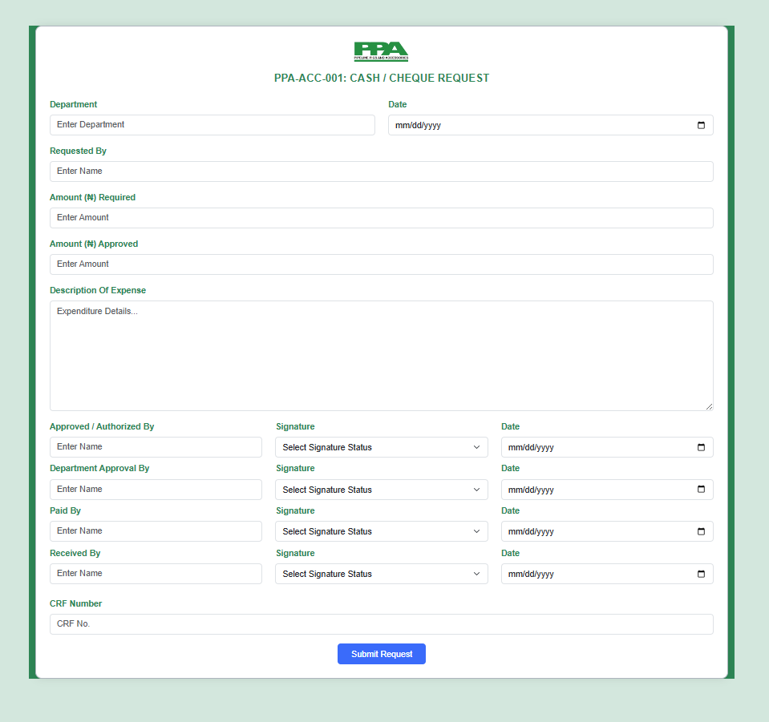

# Pipeline Pigs and Accessories Limited – Financial Forms

This repository contains **responsive, branded, and policy-compliant financial forms** developed for **Pipeline Pigs and Accessories Limited**, a Pipeline Flow Assurance Company. These forms support accurate documentation, accountability, and internal audit compliance.

---

## 📄 1. Cash / Cheque Request Form (`PPA-ACC-001`)

### ✅ Key Features:

- **Company Branding**
  - Includes the official logo and form title: **PPA-ACC-001: CASH / CHEQUE REQUEST**

- **Request Information**
  - Department and Request Date fields
  - Name of requester
  - Requested and Approved Amounts in ₦

- **Detailed Expense Description**
  - Large text area for itemizing and explaining expenditure

- **Authorization & Approval Section**
  - 4-step sign-off fields:
    - Approved/Authorized By
    - Department Approval
    - Paid By
    - Received By
  - Each has corresponding:
    - Signature dropdown (Pending / Signed / Declined)
    - Approval date field

- **Tracking**
  - CRF Number for internal reference

- **UI Features**
  - Built with **Bootstrap 5.3**
  - Uses `text-success` and `bg-success` for visual consistency
  - Responsive grid layout for desktop and mobile use

---

## 📄 2. Payment Voucher Form (`PPA-ACC-002`)

### ✅ Key Features:

- **Header Branding**
  - Company logo (`img/logo.png`)
  - Official form title: **PPA-ACC-002: PAYMENT VOUCHER**
  - Highlighted using Bootstrap’s `text-success` classes

- **Core Payment Fields**
  - Amount in Nigerian Naira (₦)
  - Date of payment
  - Payment Method: Cash / Cheque / Transfer
  - Recipient’s name and payment purpose
  - Total amount in words

- **Authorization Workflow**
  - 3-column layout:
    - **Payee**: Name, Signature Status, and Date
    - **Approver**: Name, Signature Status, and Date
    - **Paid By**: Name, Signature Status, and Date

- **Tracking**
  - Field for entering **Payment Voucher Number (PV No.)**

- **UI Features**
  - Responsive design using **Bootstrap 5.3**
  - Clean layout for both print and digital usage

---

## 📂 Folder Structure

├── index.html # Cheque Request Form (PPA-ACC-001)
├── style.css # Custom styles for both forms
├── img/
│ ├── logo.png # Company logo
│ └── cheque-request-sample.png# Sample Cheque Request preview

---

## 🖼️ Screenshots

### ✅ Form Logo
- 

### ✅ Dynamic Cheque Request Sample
- 

---

## 🚀 How to Use

### 🧾 Cash / Cheque Request
1. Fill in Department, Requested By, Date, and Amount fields.
2. Describe the intended expenses.
3. Obtain all four signatory authorizations.
4. Add CRF Number and submit.

### 💳 Payment Voucher
1. Fill in amount, date, and payment method.
2. Provide recipient name and purpose.
3. Complete Payee, Approver, and Payer authorizations.
4. Enter voucher number and submit.

---

## 🛠 Technologies Used

- **HTML5** – For semantic structure
- **CSS3** – Custom branding and layout
- **Bootstrap 5.3** – Responsive grid system and styled form components

---

## 🔖 Tags

`#PaymentVoucher` `#ChequeRequest` `#PipelinePigs` `#Bootstrap5`  
`#HTMLForms` `#InternalAudit` `#ApprovalWorkflow` `#ResponsiveDesign`

---

**📌 Developed for transparent, accurate, and compliant financial recordkeeping at Pipeline Pigs and Accessories Limited.**
